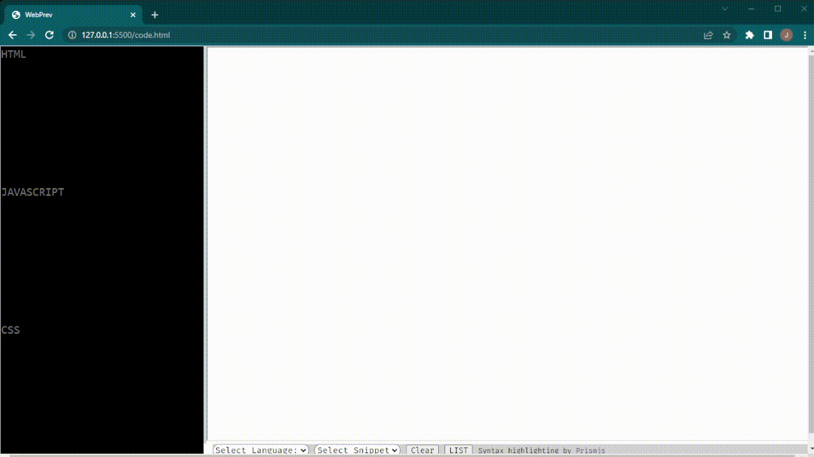

# WebPrev

Personal clone / similar to JSfiddle or CodePen, to store useful snippets.

with the purpose of being used for the exchange of code snippets in teams, keeping them saved for possible future consultations.

-----
### Usage
Put every Snippet in different folder inside *snippets* folder:

 - ./snippets/sample01/
 - ./snippets/sample02/
 -  ...

for now... put manually in the list: ./snippets/data.js

## TODO
this is a really side project, so the todo is boring :)

 - convert data.js into a json file
 - prevent double execution of js file when a snippet is loaded
 - copy single textAreas or copy all as a Single page application
 - maybe save current textareas as new snippets?
     - in this case I need to auto-regenerate json file
 - 

##  Component

> Synthax Highlighting: https://prismjs.com/ | MIT license